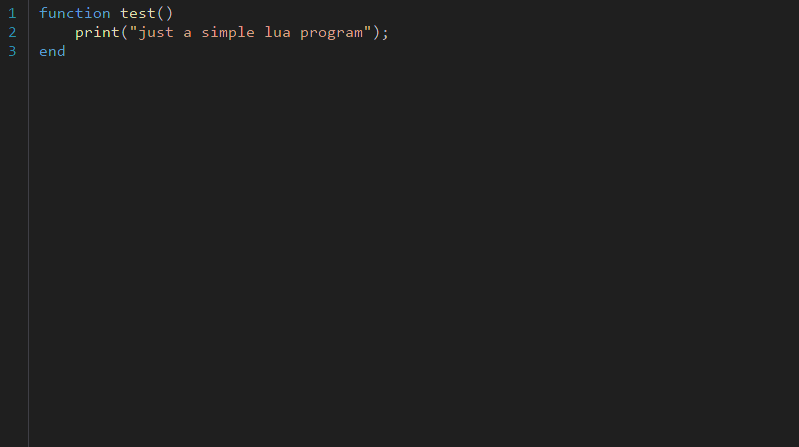
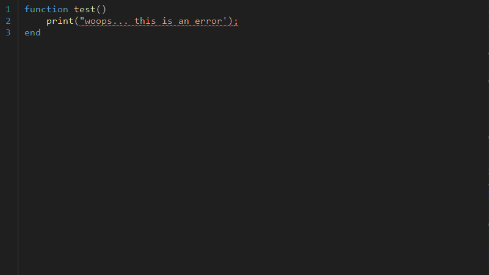
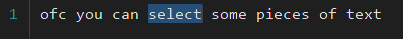
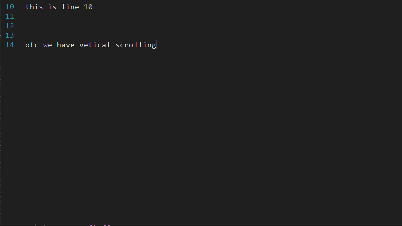
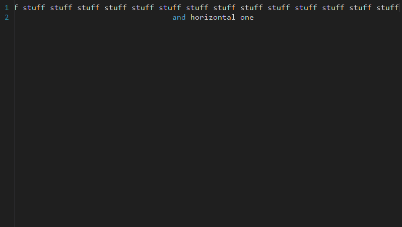
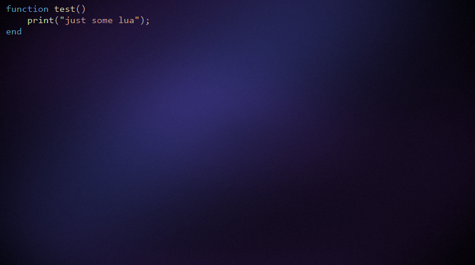

<h1 align ="center">ClayBox</h1>

<p align="center">
    
    
</p>

ClayBox is a simple yet powerful platform agnostic text box build for code editors.

# Features

<h2 align ="center">Text highlighting</h2>
<p align="center">
  
</p>

<h2 align ="center">Error checking</h2>
<p align="center">
  
</p>

<h2 align ="center">Text selection</h2>
<p align="center">
  
</p>

<h2 align ="center">Scrolling</h2>
<p align="center">
  
</p>
<p align="center">
  
</p>

<h2 align ="center">Full customizeability</h2>
<p align="center">
  
</p>

# Widgets

In ClayBox, widgets are components that extend the functionality of the text box. (eg: the line number view)

```csharp
 public class ClayLineNumberWidget(ILineNumberThemeProvider themeProvider) : IClayWidget
 {
     public uint Width { get; private set; }
     public uint Height { get; private set; }
     public ILineNumberThemeProvider ThemeProvider { get; set; } = themeProvider;

     public uint LineStartOffset { get; set; } = 1;

     Dictionary<char, ITintableImage> GlyphCache = new();
     Dictionary<char, uint> GlyphOffsetCache = new();

     ClayImage _image = new([], 0, 0);

     public ClayImage GetImage() => _image;

     public void OnEvent(ClayTextEditor textbox, ClayEventType eventType)
     {

        ...
```

all widgets must inherit `IClayWidget`, and implement `OnEvent`.
